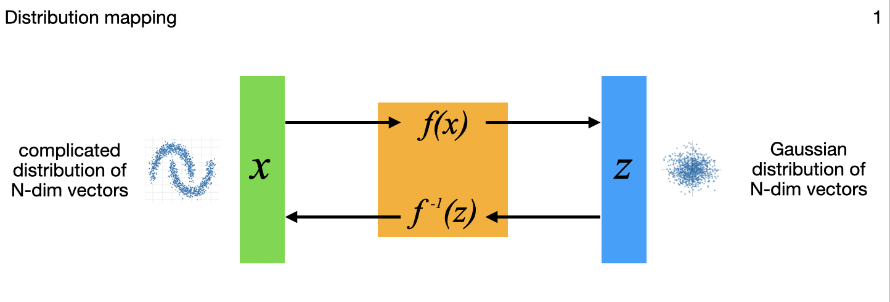

# flow_models

Flow models are invertible neural networks (INNs) — a type of generative model
that allows not only generating new samples from the learned distribution
(which GANs and VAEs do too) but also exact likelihood computation as well
(which GANs and VAEs do not).  This is accomplished with an architecture that
ensures all transformations are reversible and the Jacobian determinant is
efficiently computable.  By modeling probabilities directly, INNs allow for a
range of other applications too - a real Swiss-army-knife of the modeling world
that I'm recently fascinated with.  



These flow models transform complex data distributions into more tractable ones
(usually Gaussian) in which it's feasible to do probabilistic calculations such
as anomaly detection for example.  But these models allow far more than anomaly
detection - their capabilities allow INNs to cover generative image modeling,
generative classification, parameter estimation on ill-conditioned problems,
and (ill-posed) inverse problems with or without noise on the data.  All of
these stem from the theme of mapping one probability distribution into another.

Other implementations of INNs I've seen out there only cover one specific
application and with a lot of bespoke code.  But the Tensorflow Probability
package provides almost everything needed to implement these models in a more
encapsulated, cleaner, and easier to understand way (at least for me!).  Of
course as I expand this work I'm wrestling a number of tradeoffs in what to
generalize/simply via TFP and what to explicitly implement - part of the
learning process for me.

The above diagram summarizes, for different applications, variations in how the
N-dimensional model inputs are mapped through the flow model to N-dimensional
outputs that include a latent multivariate standard normal distribution to
capture some or all of the complex variations on the input side.  All those
output points can each be mapped back though the model to the inputs as well,
important in the image generation, uncertainty quantifaction, and inverse
problems among others.  The little images in each frame of the gif are subtle
references to the example applications I'm implementing for each variation, and
key research papers from the literature that describe these variations one at
a time.  Sorry, I acknowledge that at this summary level I'm not currently
describing what all those little images and details are yet; the papers are
referenced at the bottom of this readme though.

Work is currently still in progress - I'm gradually implementing the series of
7 applications in the figure - currently #2 is fully implemented (and documented
on my page 
["Flow_models 2: Image generation and anomaly detection as two sides of the same coin"](http://research.ganse.org/datasci/sim-cats)).
Instructions for using/running that follow below, and similar ones are upcoming
for the other applications as well.  Point being, it's all the same model, just
with a few variations in the partitioning of the inputs and outputs.


### A. To install/prepare
1. For full runs on a GPU-enabled EC2 instance (as opposed to just initial
   smaller scale testing on a CPU-only instance), I recommend following
   [these instructions](https://github.com/aganse/py_tf2_gpu_dock_mlflow/blob/main/doc/aws_ec2_install.md)
   from my [py_tf2_gpu_dock_mlflow](https://github.com/aganse/py_tf2_gpu_dock_mlflow)
   repository to set that up.

   I'm also working on some scripts to kick off the training remotely in a
   Docker container via AWS ECR using AWS Batch (that's what's in subdir
   `awsbatch-support`), but that's not ready yet.  Meanwhile, simply installing
   on the GPU-enabled instance per those instructions linked above allows to
   run the training on there.

2. Create the python environment and install dependencies:
    ```
    > make create-env
    Creating/installing new python env /home/ubuntu/src/python/flow_models/.venv3
    ```
    (this is just a convenience macro to run the usual `python3 -m venv .venv &&
    source .venv/bin/activate && pip install -r requirements.txt`.  except note
    this macro creates new .venvN subdirectories incrementing N to avoid
    overwriting existing env subdirectories.)

3. Get images to train/test with:

    Of course you can use whatever images you want.  For my experimentation I
    used the really nicely curated Kaggle dataset
    [animal-faces](https://www.kaggle.com/datasets/andrewmvd/animal-faces).

    If using a dedicated GPU-enabled instance, you could save these image files
    directly on that instance in a `data` subdir within the `flow_models` repo
    directory.  For that case the URIs for train_generator and other_generator
    in train.py can simply be `"data/train"` for example.  Or you can use image
    files in an S3 bucket, whether in the dedicated GPU-enabled instance or
    in a batch configuration.  For that case the URIs should have the form
    `"s3://mybucket/myprefix/train"`.

    This is not supervised learning so labels are not used for training, but
    it can still be useful to reserve some validation data to experiment with
    after training anyway.  Whether locally or in S3, I find the following
    directory structure helpful.  Note the data generator reading the files
    will combine all subdirectories of files together, so `cat` and `beachball`
    images will be mixed together in the validation dataset:

    ```
    data/
        train/
            cat/
        val/
            beachball/   <-- these show up as outliers in gaussian latent points
            cat/         <-- these don't
    ```

### B. To run the training
1. Enter the python environment created above if not already in:  `source .venv/bin/activate`
2. Set environment variable `export TF_CPP_MIN_LOG_LEVEL=2` to squelch a number of status/info lines spewed by Tensorflow and Tensorflow
    Probability (TFP) that I don't find too helpful and that make a mess in the console output.  (Similarly note I've put a python line
    at the top of train.py to squelch `UserWarning`s that are spewed by TFP.)
3. Set desired parameters in `train.py`.
4. Run `python train.py`.


### Some key references

* Distribution mapping and generative image modeling with INNs
  - [RealNVP paper](https://arxiv.org/pdf/1605.08803)
  - [NICE paper](https://arxiv.org/pdf/1410.8516)
  - [Glow paper](https://arxiv.org/pdf/1807.03039)

* Generative classification and ill-conditioned parameter estimation with INNs
  - [Ardizzone 2019 INNs paper](https://arxiv.org/pdf/1808.04730)

* Bayesian inverse problems with INNs
  - [Zhang & Curtis 2021 JGR paper](https://agupubs.onlinelibrary.wiley.com/doi/pdfdirect/10.1029/2021JB022320)

* TensorFlow Probability components
  - [tfp.bijectors.RealNVP API](https://www.tensorflow.org/probability/api_docs/python/tfp/bijectors/RealNVP)
